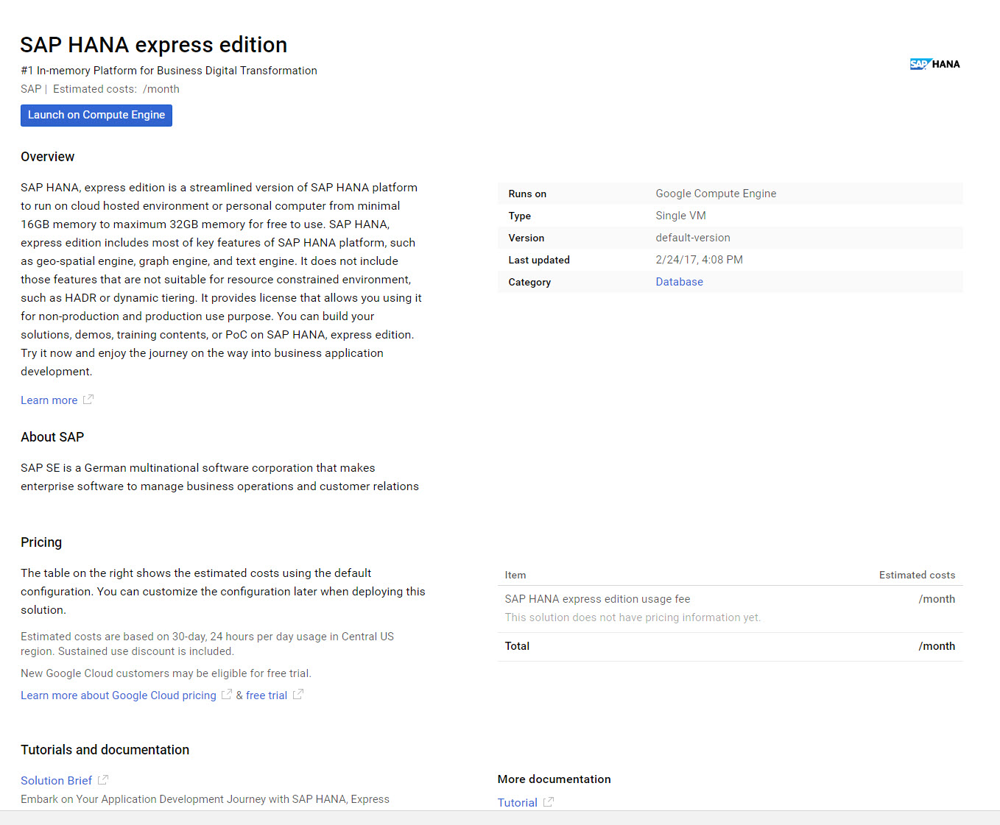
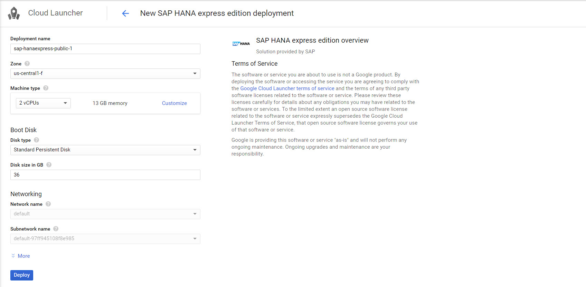
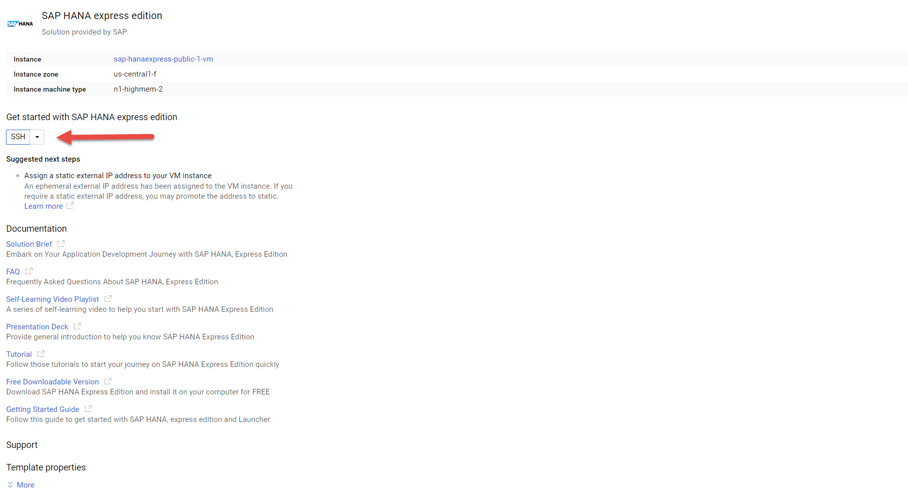
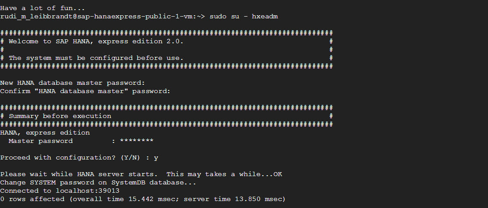
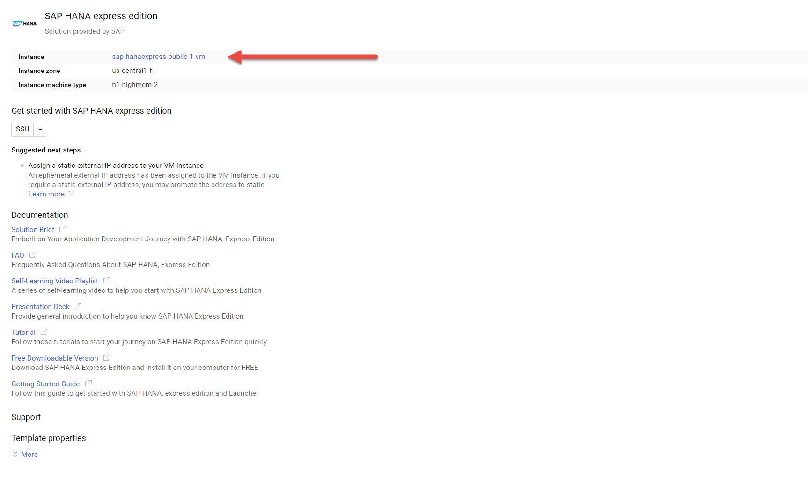

## Prerequisites 
 - You have a Google Account and/or have registered for the free trial on `cloud.google.com`

## Disclaimers
- The image currently only includes the HANA database engine - XSA is not installed by default.   

## Next Steps
- [Prepare SAP HANA, express edition for the SAP HANA Tutorial Catalog](http://www.sap.com/developer/how-tos/2016/09/hxe-howto-tutorialprep.html)
- [Review SAP HANA, express edition content, tutorials and quick start guides](http://www.sap.com/developer/topics/sap-hana-express.html)
- [**OPTIONAL** - Setup PuTTY and WinSCP to access your SAP HANA, express edition instance on Google Cloud Platform](http://www.sap.com/developer/tutorials/hxe-gcp-setup-putty-winscp-windows.html)  

## Details

### You will learn  
 - How to create a new Google Cloud Platform virtual instance based on SAP HANA, express edition
 - How to set your new instance, and enable it for tutorials and developing your first applicaiton

### Time to Complete
**15 Min**

---

[ACCORDION-BEGIN [Step 1: ](Launch SAP HANA, express edition from the Google Cloud Platform Launcher)]

Navigate to [Google Cloud Launcher](https://console.cloud.google.com/launcher), and search for SAP HANA, express edition.

1.  Click on the **`Launch on Compute Engine`** button.    The next page will allow you to modify the default configuration for the Cloud Virtual Machine.

2.  Type an identifying name for the instance, then select the desired geographic zone and machine type. Individual zones might have differing computing resources available and specific access restrictions.

3.  The default settings for RAM, CPU and Storage is appropriate for getting familiar with SAP HANA.    The recommended minimum configuration is 13GB of RAM, with at least 2VCPUs, and 36GB of storage.

4.  By default, the firewall rules are configured specifically for SAP HANA, express edition.  As new SAP HANA applications are created, additional ports might have to be opened up.   The following ports are required to connect to SAP HANA, express edition 39013, 39015, 59013, 59014.    To connect to the instance from a local SSH client (Like putty), port 22 also has to be open.

5.  After reviewing all configuration options, click **"Deploy"**.    This will take a few minutes.

6.  Upon successful deployment - use the web based SSH tool and log into instance, and type `sudo su - hxeadm`.   

7.  Follow the prompts to change password.   **SAP HANA will not be useable if this step is ignored.**

8.  To connect to SAP HANA, we need to know what the external IP adress is.  Click on the "Instance" link at the top of the page to drill into instance details.   Scroll down and make a note of the external IP adress.

[DONE]
[ACCORDION-END]

[ACCORDION-BEGIN [Step 2: ](Generate Key pairs to connect to your VM instance)]

To connect to your newly deployed instance via SSH, review the documentation at https://cloud.google.com/compute/docs/instances/connecting-to-instance

[DONE]
[ACCORDION-END]

[ACCORDION-BEGIN [Step 3: ](Prepare your instance for SAP HANA, express edition tutorials)]

Your SAP HANA, express edition instance is now up and running.  Proceed to the "Next Steps" section, and set up your SAP HANA, express edition

[DONE]
[ACCORDION-END]

## Optional
- [Setup Putty and WinSCP in your Windows PC](http://www.sap.com/developer/tutorials/hxe-gcp-setup-putty-winscp-windows.html)

## Next Steps
- [Prepare SAP HANA, express edition for the SAP HANA Tutorial Catalog](http://www.sap.com/developer/how-tos/2016/09/hxe-howto-tutorialprep.html)
- [Review SAP HANA, express edition content, tutorials and quick start guides](sap.com/developer/topics/sap-hana-express.html)

